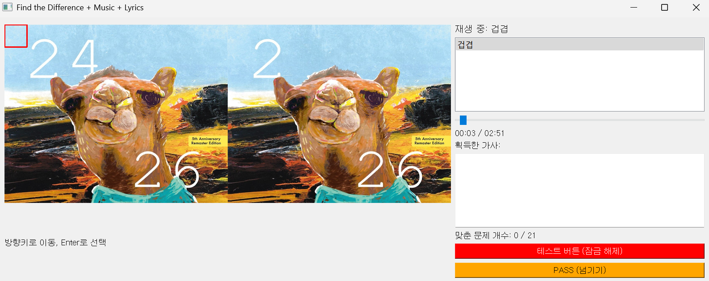
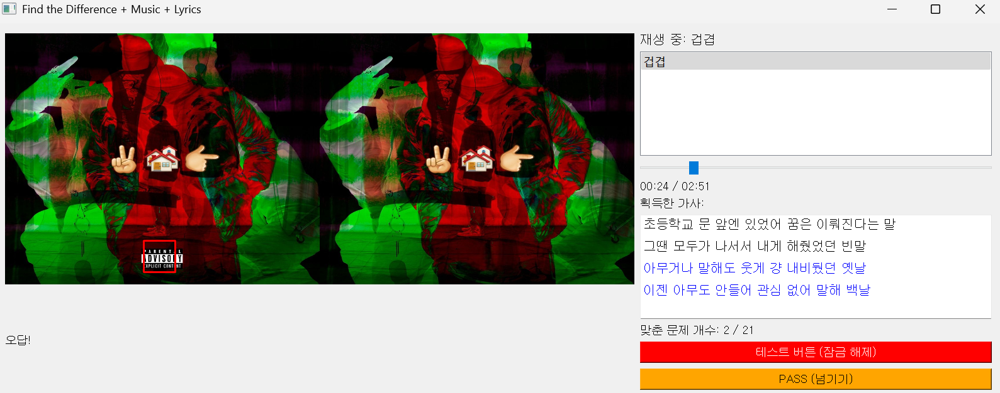
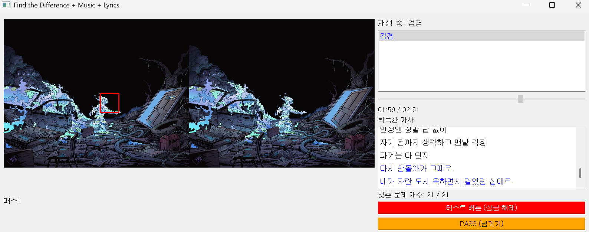
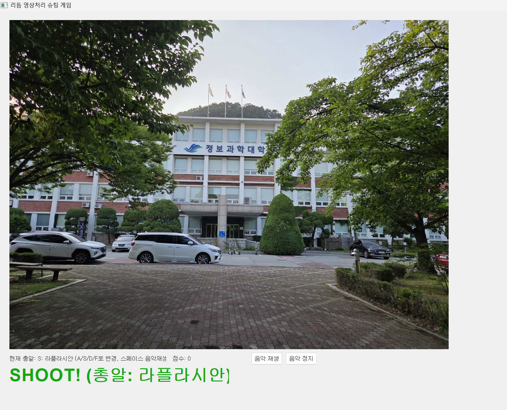
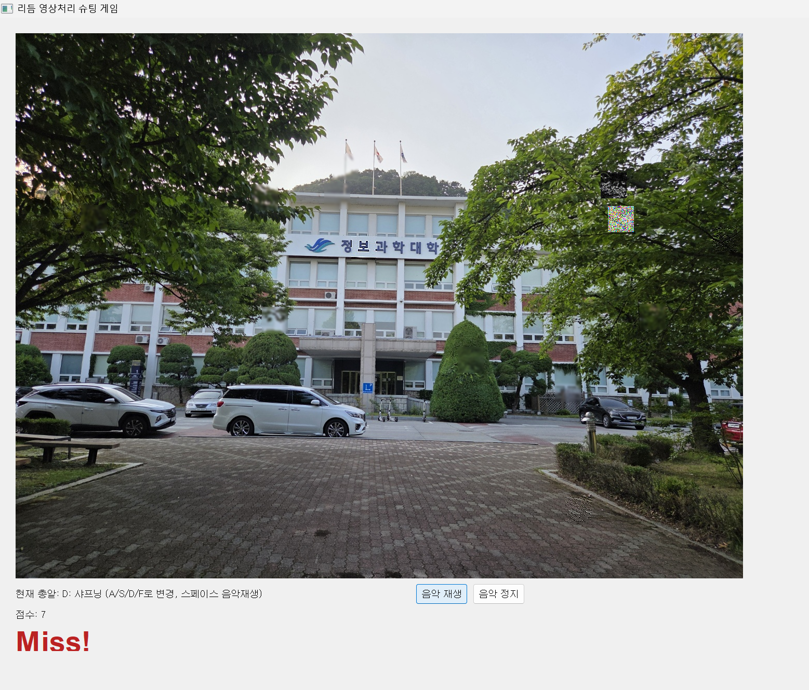
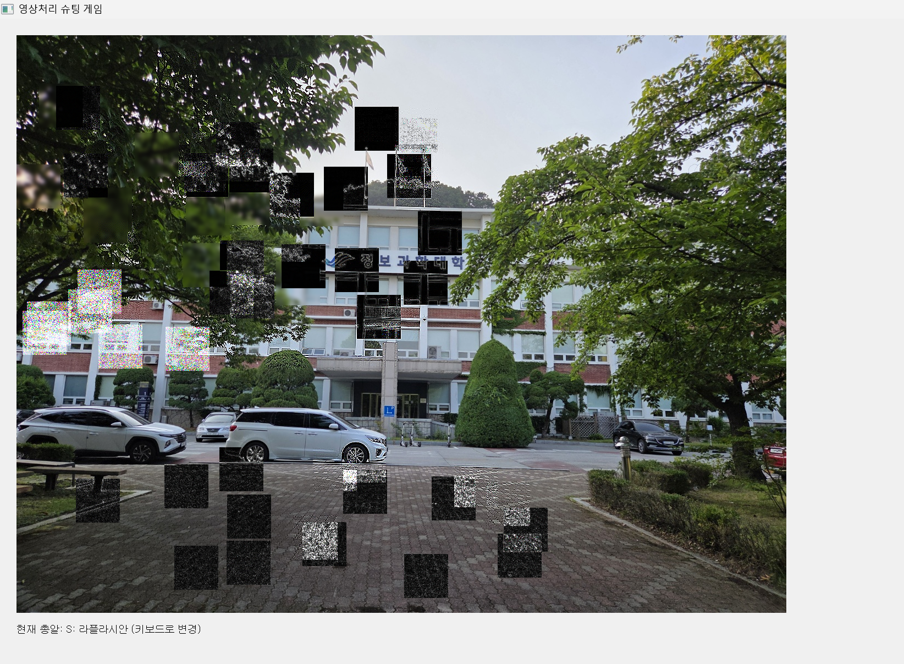

# Image Processing Games

### 틀린그림찾기 & 필터 슈팅 게임
- **2023-2 영상처리 프로그래밍 기말 프로젝트** 
- **담당 교수:** 박섭형 교수님

---

## 프로젝트 소개
## 틀린 그림 찾기 게임
-	키보드 화살표를 이동하여 박스를 이동하여 enter를 누르면 된다.
-	왼쪽 오른쪽 이미지를 비교하여 다른 부분 1개를 찾는 게임이다. 
-	정답을 맞추면 2줄씩 가사가 드러나며, 전체 해금 시 음악 전체 자유롭게 감상 가능
-	음악이 끝나기 전에 모든 가사를 획득해야한다.
-	어려우면 pass 버튼 누르기
-	테스트 잠금 해제 버튼을 누르면 모든 가사를 한번에 획득할 수 있다.

   

   

   

## 필터 슈팅 게임
-	화면에 랜덤한 위치에 타겟 박스가 생성된다.
-	플레이어는 해당 박스를 마우스로 클릭해 명중해야 하며, 성공 시 영상처리 효과가 해당 영역에 적용된다.
-	영상처리 필터를 총알로 사용한다. A: 가우시안 블러S: 라플라시안D: 샤프닝 F: 가우시안 노이즈
-	플레이어는 키보드 단축키로 필터를 선택하고 해당 총알이 요구되는 타켓에 정확히 명중해야 점수를 얻는다.
-	오답이거나 타이밍을 놓치면 Miss 처리. 

   

   

   

---
## 주제 선정 동기

## 틀린 그림 찾기 게임
   
작년에 개인 앨범을 완성할 때쯤 GXG2024 판교 게임 문화 축제에 갔다. 

그때 AI음악 프로그램과 인디 게임 체험을 하다가 게임 ost 공연을 보고 왔는데 

앨범을 게임 형식으로 내면 재밌을 것 같다는 생각이 들었다. 

그렇게 시간이 흘러 영상처리 프로그래밍 기말 프로젝트로 영상처리 기반 음악 게임을 구현하게 되었다.

추후에 더 보완하여 졸업하기 전에 앨범과 게임을 공개하는 것이 목표다. 

## 필터 슈팅 게임

퍼즐 게임을 제작 후 수업 시간에 배운 영상처리 효과들을 적용해볼 수 있는 더 재미있는 게임을 만들어보고 싶었다.

시험기간에 흔히 장난으로 얘기하는 “학교가 날아가버렸으면 좋겠어” 밈이 생각나서 

공학관 파괴 게임을 만들어보면 재밌겠다는 생각을 하게 되었다. 

총알 종류를 계속 추가하면서 영상처리 효과들을 배워나가면 재밌게 공부할 수 있지 않을까.

---
## 기술 스택
#### 이미지 비교 및 분석 (OpenCV)

| 함수 및 기능                                     | 설명                                            |
|-----------------------------------------------|-----------------------------------------------|
| `cv2.absdiff(img1, img2)`                     | 두 이미지의 픽셀별 절대 차이를 계산하여 달라진 부분 확인  |
| `cv2.cvtColor(..., cv2.COLOR_BGR2GRAY)`       | 차이 이미지를 흑백으로 변환하여 연산 속도 향상       |
| `cv2.threshold(gray, 30, 255, cv2.THRESH_BINARY)`| 흑백 이미지를 이진화하여 차이가 있는 영역만 강조     |
| `cv2.findContours(...)`                       | 이진화된 이미지에서 차이가 있는 부분의 외곽선 추출    |
| `cv2.boundingRect(contour)`                   | 추출된 외곽선을 감싸는 최소 사각형의 좌표 계산       |

| 함수 및 기능                                       | 설명                                  |
|-------------------------------------------------|-------------------------------------|
| `cv2.GaussianBlur(roi, (11,11), 0)`             | 관심 영역(ROI)에 가우시안 블러 효과 적용        |
| `cv2.Laplacian(roi, cv2.CV_64F)` + `convertScaleAbs()` | 관심 영역의 경계를 강조 (2차 미분 마스크)        |
| `cv2.filter2D(roi, -1, kernel)`                 | 사용자 정의 커널을 통한 샤프닝 필터 적용         |
| `np.random.normal(0, 25, roi.shape)` + `cv2.add()`| 관심 영역에 가우시안 노이즈 추가              |
| `cv2.rectangle`, `cv2.putText`                  | 이미지 위에 박스 및 텍스트를 직접 시각화        |

#### 음악 재생 및 UI 구성 (PyQt5)

| 위젯 및 기능                                    | 설명                                         |
|----------------------------------------------|--------------------------------------------|
| `QMediaPlayer` + `QUrl.fromLocalFile()`      | .wav 파일 음악 재생 및 제어                   |
| `QTime.currentTime()` + `msecsTo()`          | 사용자의 타겟 반응 시간을 밀리초(ms) 단위로 정밀 측정 |
| `QTimer.start(ms)` + `timeout.connect(slot)` | 타겟의 생성 주기 및 유지 시간 제어             |
| `QImage(...)` → `QPixmap.fromImage()`       | OpenCV 이미지를 PyQt5에서 화면에 표시 가능한 형식으로 변환 |
| `QLabel`, `QTextEdit`, `QListWidget`, `QSlider`, `QPushButton` | 다양한 인터랙티브 요소 구현                   |
---
